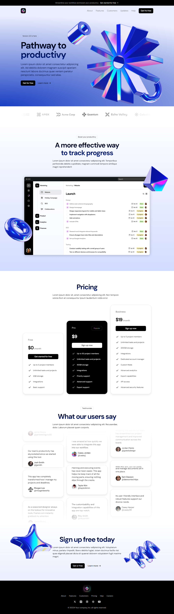

    <h3 align="center">Página de Destino</h3>

  

    Landing page que captura a atenção e deixa uma impressão duradoura. Com animações impressionantes e design responsivo usando ferramentas de ponta como React, Next.js, TailwindCSS e Framer Motion.
  

   
    
   

  

    
    
    
    
    
  

 
 
Clique aqui para acessar  ↓↓↓ 
https://pagina-de-destino-saas.vercel.app/

  ## Como Executar

  1. Clone o repositório: `git clone https://github.com/matheusrodrigues1/PaginaDeDestino-SaaS/tree/new`
  2. Entre na pasta raiz do projeto: `cd 'new arquivo'`
  3. Instale as dependência: `npm install`
  4. Rode o servidor: `npm run dev`

  ## Autor

  ✉️: [Email](carlostech873@gmail.com) 
  📄: [Currículo](https://drive.google.com/file/d/1Jfn9RAqFR3YaQbL8j_lJA0z8HHlLI3Xq/view?pli=1) 
  💼: [Linkedin](https://www.linkedin.com/in/matheus-rodrigues-1a1899231/) 
  📸: [Instagram](https://www.instagram.com/math.eusrrodrigues/)

